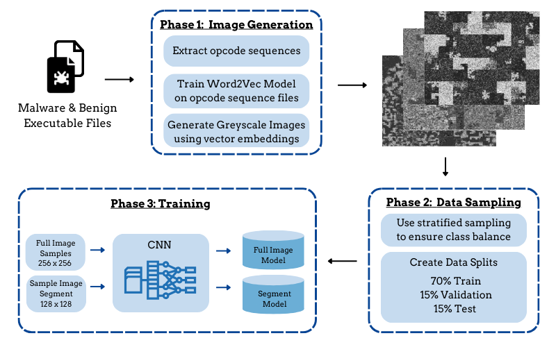
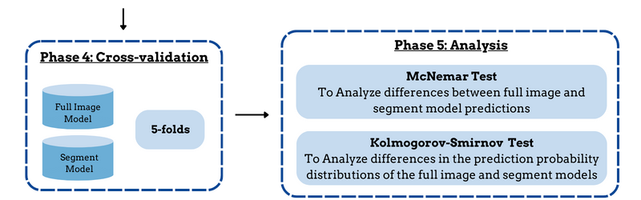

# Malware Classification: Exploring CNN Image Segmentation

## Research Pipeline



## Dash Website 

### Application Directory
This section of the repository contains files related to the published dash application for this project. 
Includes  ```READme.md``` file with file stucture outline, requirements, and deployment instructions.
A published version of the site can be found [here](https://senior-project-457222.wl.r.appspot.com).

### Metrics and Testing Data Directory 
Contains csv and json data results from various analysis and model training metrics output. 
These files are necessary for application deployment.

### Plots
Contains static plot .png image files for visualizations not rendered live. 

### Research Code Files 
All code files used in the preprocessing, image generation, and training for this project. 

